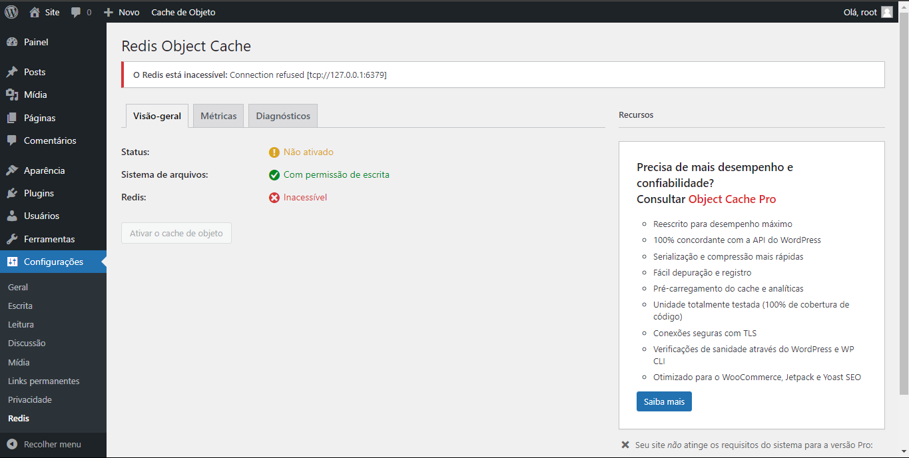
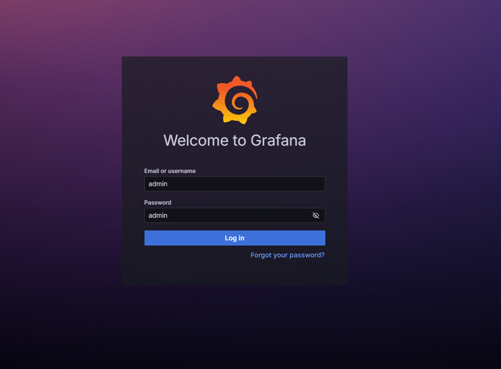

<body style="text-align: justify">
    <h1>Como rodar o projeto:</h1>
    

        <h2>Passo 1: Configurando o ambiente</h2>
        <ol>
            <li>
Tenha (ou instale) o docker em sua máquina.
</li>
            <li>
                

                    Certifique-se que as portas que serão utilizadas no projeto estejam disponíveis para uso, caso não modifique-as.
                

                
São elas:

                <ul>
                    <li>9104 : mysql-exporter</li>
                    <li>6379 : redis</li>
                    <li>8080 : wordpress</li>
                    <li>9090 : prometheus</li>
                    <li>3000 : grafana</li>
                    <li>8081 : cadivisor</li>
                </ul>
            </li>
        </ol>
    

    

    

        <h2>
            Passo 2: Clonar e acessar repositório do projeto
        </h2>
        <ol>
            <li>
                

                    Em qualquer pasta do seu computador, de preferência uma pasta que não possua caracteres especiais.
                

                

                    Em seguida abra o git bash e digite o código a seguir:
                

                <pre><code>git clone https://github.com/Lucas-Dreveck/ProjetoFinalDocker</code></pre>
            </li>
            <li>
                Com o projeto clonado em sua máquina, acesse a pasta do projeto:
                <pre><code>cd ProjetoFinalDocker</code></pre>
            </li>
        </ol>
    

    

    

        <h2>Passo 3: Executar o projeto</h2>
        <ol>
            <li>
                Inicie o Docker Swarm para poder iniciar o projeto:
                <pre><code>docker swarm init</code></pre>
            </li>
            <li>
                Em seguida, execute o comando:
                <pre><code>docker stack deploy -c docker-compose.yml "nome_stack"</code></pre>
                com este comando vamos iniciar nossos services que estão no arquivo .yml sendo eles:
                <ul>
                    <li>mysql - database</li>
                    <li>mysql-exporter - exporta os dados do mysql para serem acessados pelo prometheus</li>
                    <li>redis - usado para armazenar em cache as querys feitas pelo wordpress</li>
                    <li>wordpress - nosso site</li>
                    <li>prometheus - ferramenta de monitoramento</li>
                    <li>grafana - transforma os dados do prometheus em dashboards para melhor visualização</li>
                    <li>cadvisor - ferramenta para monitorar o docker e seus containers</li>
                </ul>
            </li>
        </ol>
    

    

        <h2>Passo 4: Configurar o wordpress</h2>
        <ol>
            <li>Abra seu navegador e acesse o link: <code>http://localhost:8080</code></li>
            <li>
                Ao acessar o wordpress, configure-o seguindo suas instruções, Obs: não se preocupe com os dados informados, todos são apenas para teste.
            </li>
            <li>
                Finalizando o processo de configuração do worpress, você será redirecionado à pagina de administrador:
                                  
            </li>
            <li>
                Nesta página, acesse a opção de plugins. Você será redirecionado para esta pagina onde estão os plugins instalados:
                
            </li>
            <li>
                Ao lado da palavra Plugins, no topo da página, você terá a opção de Adicionar Plugin. Apertando nesse botão, você será redirecionado para esta página:
                
            </li>
            <li>
                Pesquise, na opção de busca, o plugin: <code>Redis Object Cache</code>
                
                Aperte na opção instalar, aguarde instalar e, após a instalação, volte para a página de <code>Plugins Instalados</code>
            </li>
            <li>
                Abaixo dos plugins já instalados, irá aparecer o Redis Object Cache. Selecione a opção de Ativar (também pode aparecer como Configurações). Ao acessar essa página, podemos ver que não é possível nos conectar com o redis:
                
            </li>
        </ol>
    

    

        <h2>Corrigir erro de conexão entre o Redis e o Docker</h2>
        <ol>
            <li>
                Entre no seu terminal e digite o comando <code>sudo su</code> para trocarmos para o usuário root do sistema. Faça login com sua senha de root e em seguida digite o comando <code>docker ps</code>, que lista todos os containers em execução. Nessa lista, procure pelo container que está instanciando o wordpress e copie o CONTAINER ID dele.
            </li>
            <li>
                Execute o comando <code>docker exec -it "ID DO SEU CONTAINER" bash</code> para acessar a máquina que está executando o wordpress.
            </li>
            <li>
                Em seguida, execute os seguintes comandos para atualizar o apt e baixar o aplicativo nano, para que possamos editar o arquivo wp-config.php:
                <pre><code>apt update</code></pre>
                <pre><code>apt install nano</code></pre>
            </li>
            <li>
                Após a conclusão do passo anterior digite o comando:
                <pre><code>nano wp-config.php</code></pre>
            </li>
            <li>
                Ao acessar a interface do nano procure a linha que diz <code>/* That's all, stop editing! Happy publishing. */</code>
                E adicione as linhas:
                <pre><code>define('WP_CACHE', true); define('WP_REDIS_HOST', 'redis'); define('WP_REDIS_PORT', 6379);</code></pre>
            </li>
            <li>
                Salve o arquivo com o comando: "CTRL+O"; 
                Feche o arquivo com o comando: "CTRL+X";
            </li>
            <li>
                Volte ao painel de plugins do wordpress, atualize a página apertando "F5" e confira se o Redis aparece como Acessível:
                
                Estando assim, basta apertar no botão "Ativar o cache de objeto" e o Redis está configurado.
            </li>
        </ol>
    

    

        <h2>Passo 5: Acessar o Prometheus</h2>
        <ol>
            <li>
                Acesse o link <code>http://localhost:9090</code> para acessar a tela inicial do Prometheus, também chamada de Graph. Nesta tela podemos executar consultas de métricas.
            </li>
            <li>
                Podemos nele verificar metricas dos containers:
                <pre>container_cpu_system_seconds_total container_fs_reads_total container_fs_limit_bytes</pre>
                Também podemos visualizar as metricas do mysql:
                <pre>mysql_exporter_collector_success mysql_global_status_connections mysql_global_status_max_used_connections</pre>
                Entre várias outras métricas.
            </li>
        </ol>
    

    

        <h2>Passo 6: Dashboard do Grafana</h2>
        <ol>
            <li>
                Acesse <code>http://localhost:3000</code> para acessar a página do grafana.
            </li>
            <li>
                Utilize o usuário admin e senha admin para entrar.
                
            </li>
            <li>
                Pela dashboard, entre em Connections e acesse a opção "Data sources".
                
            </li>
            <li>
                Nessa aba, aperte o botão "Add data source" e busque pelo Prometheus.
            </li>
            <li>
                Para configurar o data source do prometheus, selecione-o na lista.
                Em Connection, adicione a url do servidor do prometheus: <code>http://prometheus:9090</code>.
                
            </li>
            <li>Após adicionar sua url, vá ao final da página e aperte o botão "Save & test". Assim, podemos ir para a dashboards.</li>
            <li>Na dashboards do grafana, aperte em "Create Dashboard" e em seguida "Add visualization".</li>
            <li>No modal que apareceu, selecione o Prometheus.</li>
            <li>Na opção Query, selecione a métrica do Prometheus e aperte em run query.</li>
            <li>
                Assim, será gerado um gráfico e podemos apertar na opção "Apply" no canto superior direito
                
            </li>
        </ol>
    

    

        <h2>Passo Bônus: Cadvisor</h2>
        <ol>
            <li>Caso queira olhar os gráficos dos containers e do docker, você pode acessar o cadvisor pela url <code>http://localhost:8081</code>.</li>
        </ol>
    

</body>
